## Web Exploitation

### inspect
  - wget -m -p -E -k -K -np HOST_URL

### picoCTF 2024
#### IntroToBurp
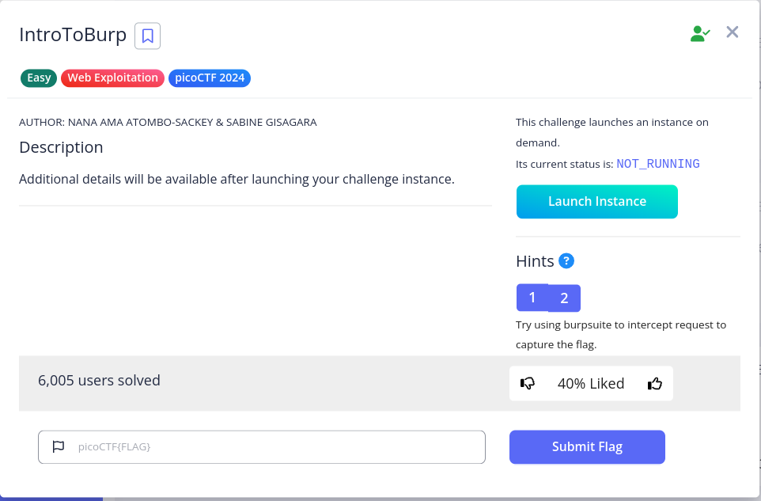

> fill "Registration" and in next step don't send "OPT" and [DONE].

---
---
### picoCTF 2023
#### More SQLi
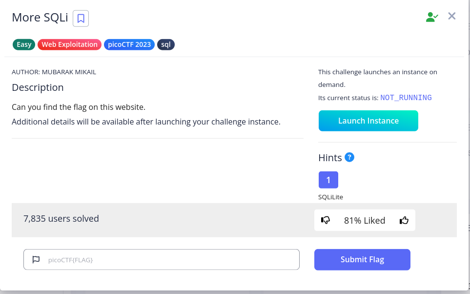

> just inject `' or 1=1;--` in password field.

 

> list all of tables with this query : `SomeThings' UNION SELECT name, sql, null from sqlite_master;--`

 

> in `more_table` table `flag` cloumn is exist, so we trying to "select flag from more_table" with this query : `SomeThings' UNION SELECT id, flag, 3 from more_table;--` and [DONE].

---
---
### picoCTF 2022
#### SQLiLite
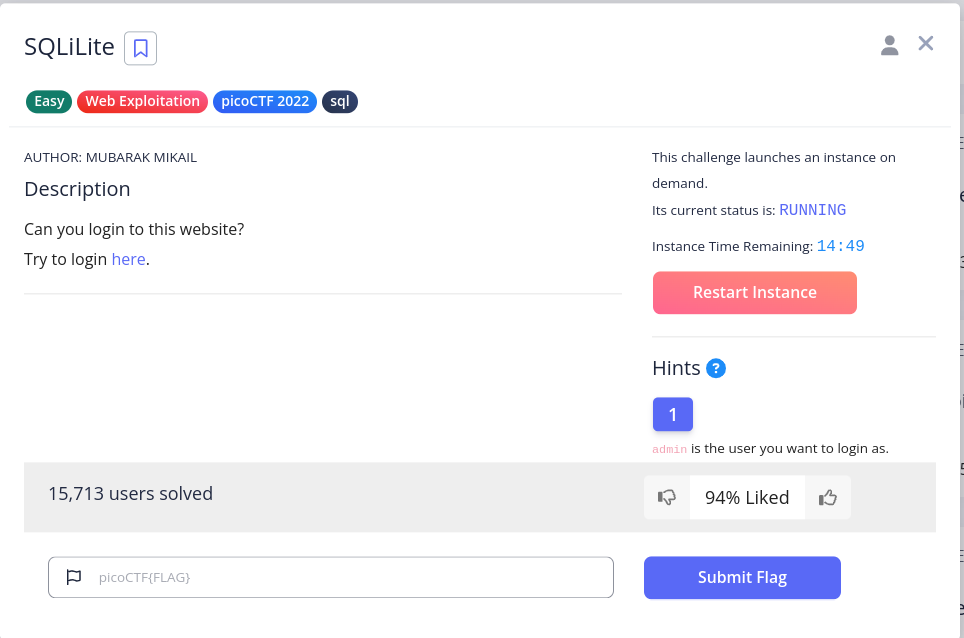

> in first step use we trying to login as "admin" user with this request and inject `' or '1'='1';--` in password filed.

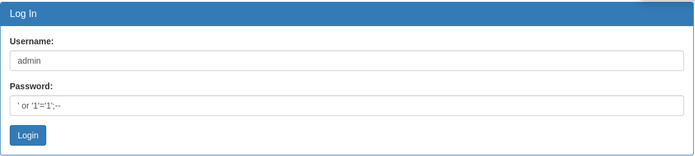

> after login see this massage so we trying to inspect this page and [DONE].

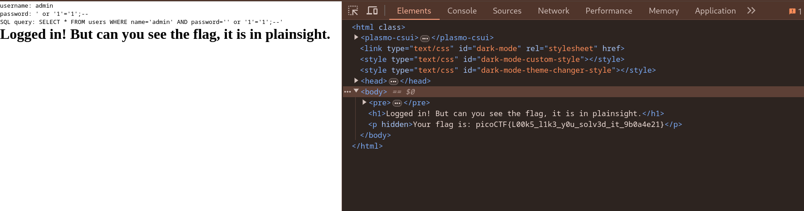

---
#### SQL Direct
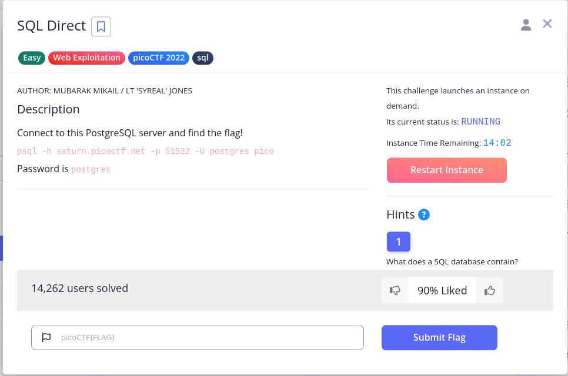

> i use docker postgres container for connect this PostgreSQL server:

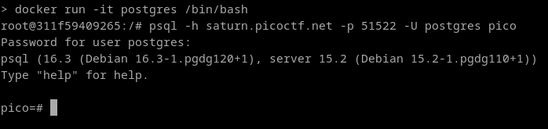

> trying to print list of all tables with this query ` \dt+ *.*` to find related table to this question.

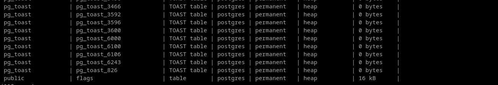

> Dump 'flags' tables with this query : `select * from flags` and [DONE].

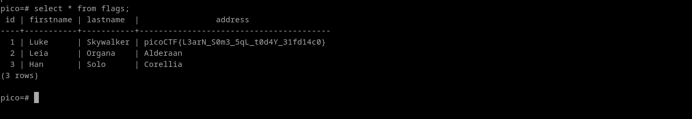

---
#### Roboto Sans
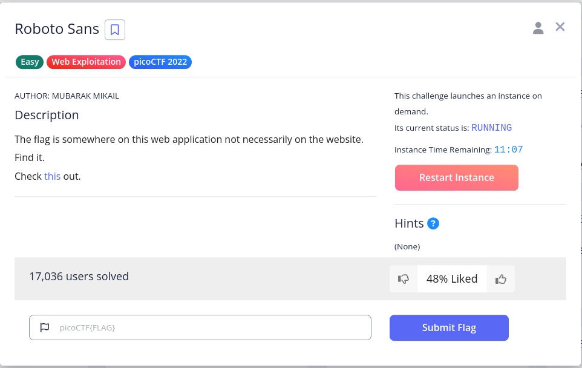

> trying to load site and see first page.

> The name of this challenge reminds us of the "robots.txt" file so after load this site i try to print "robots.txt"‌ file.

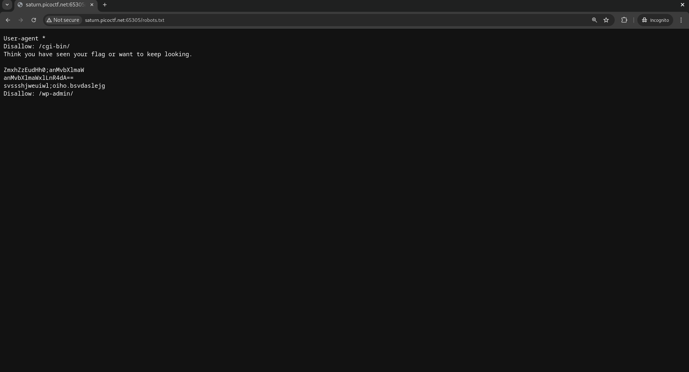

> in this file some information like [Base64](https://en.wikipedia.org/wiki/Base64) format, so i try [CyberChef](https://gchq.github.io/CyberChef/) to decode this strings.

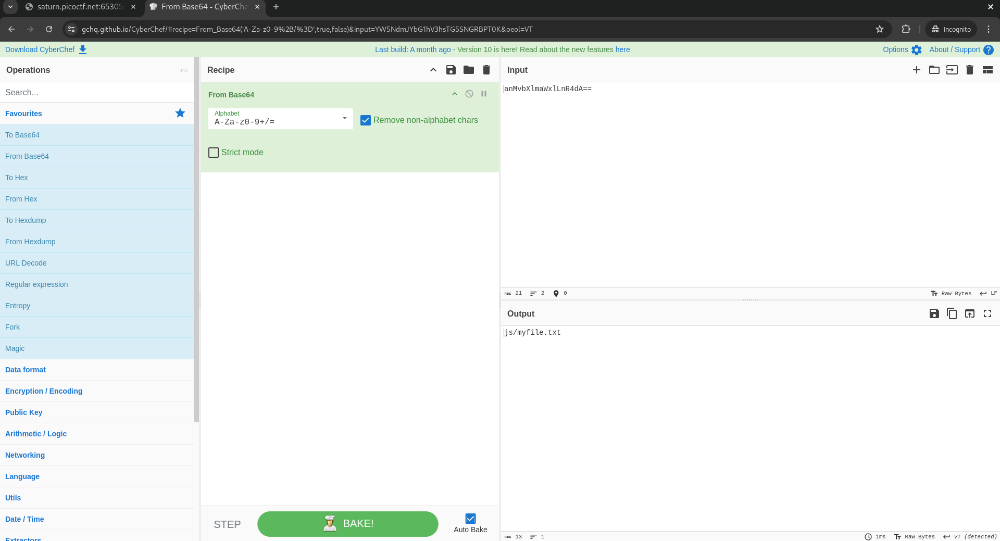

> in next step open file "js/myfile.txt" and [DONE].

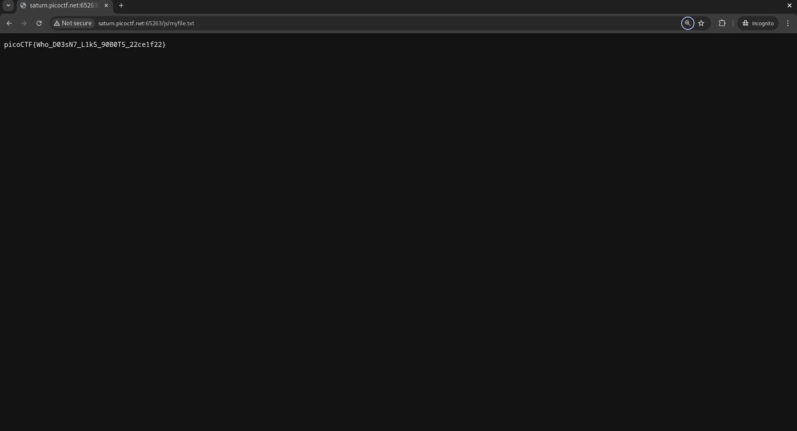
