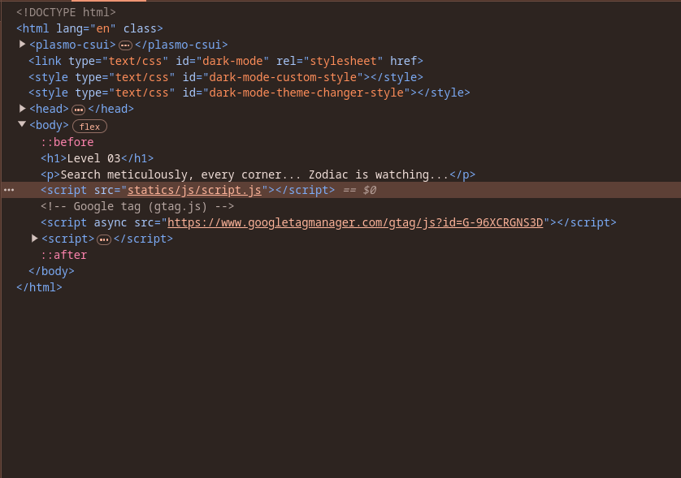
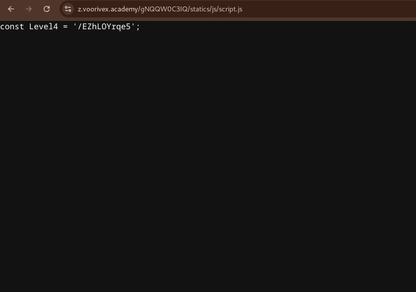
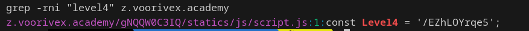

url:‌ https://z.voorivex.academy/gNQQW0C3IQ
hint: Search meticulously, every corner... Zodiac is watching...

next level url :‌ https://z.voorivex.academy//EZhLOYrqe5

> how can find this ?

1- in first step trying to inspect this page:
 

2- find js file located at `statics/js/script.js`, so trying to read that from url "https://z.voorivex.academy/gNQQW0C3IQ/statics/js/script.js":
 

Another way to inspect and check existing files to find the path to the next level use `wget` and `grep` tools with next command:
- use this command for dump page and related files:
> wget -m -p -E -k -K -np https://z.voorivex.academy/gNQQW0C3IQ
- use this command for find next level path (we know the next level path like this format '... level4 ... PATH_TO_NEXT_LEVEL'):
> grep -rni "level4" z.voorivex.academy

