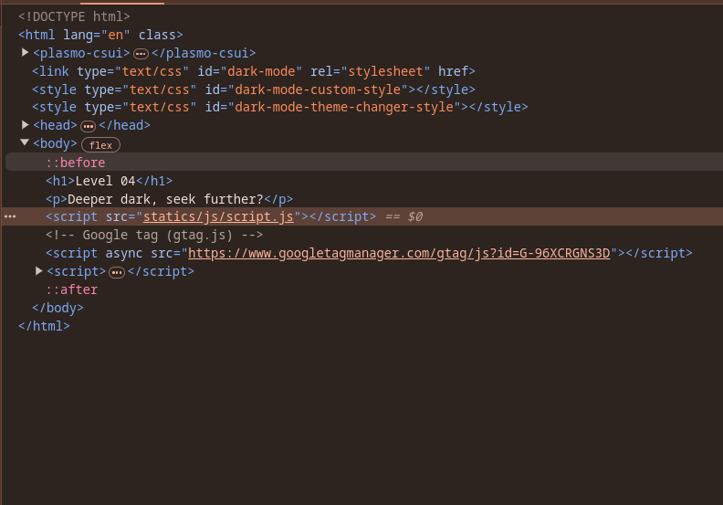
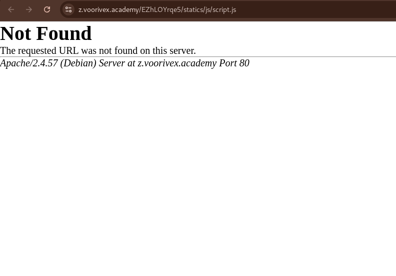
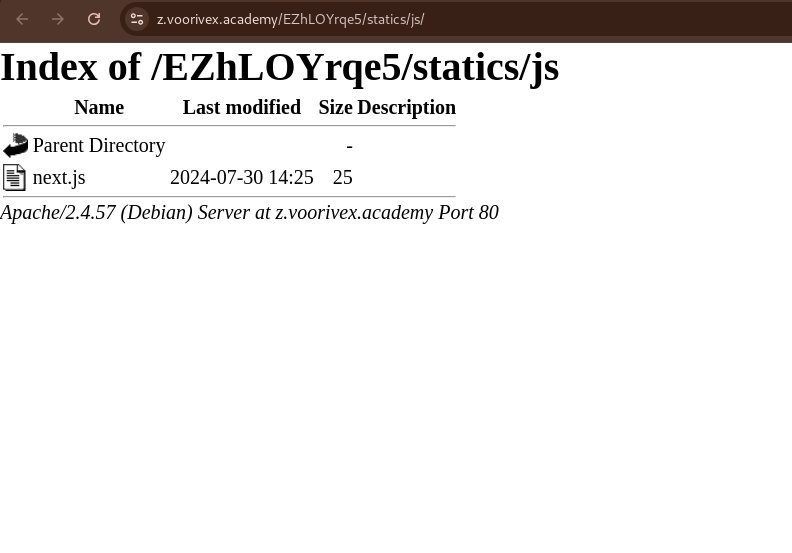
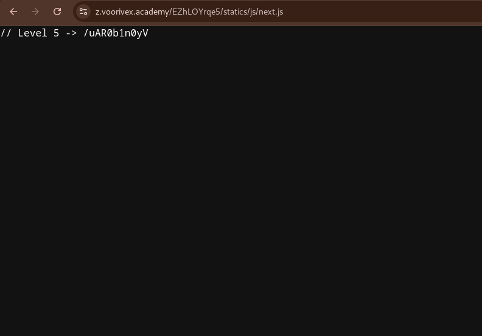

url:‌ https://z.voorivex.academy/EZhLOYrqe5/
hint: Deeper dark, seek further?

next level url :‌ "https://z.voorivex.academy/uAR0b1n0yV/"

> how can find this ?

1- As in the previous step, we first inspect the first page:
 

2- find js file located at `statics/js/script.js`, so trying to read that from url "https://z.voorivex.academy/EZhLOYrqe5/statics/js/script.js" OPPPPPSSSS file not found :)) :
 

3- so trying to [Directory Listing Vulnerability](https://portswigger.net/kb/issues/00600100_directory-listing) and remove `script.js` and use this url to test it "https://z.voorivex.academy/EZhLOYrqe5/statics/js/":

4- and trying to read `next.js` file from url "https://z.voorivex.academy/EZhLOYrqe5/statics/js/next.js":

