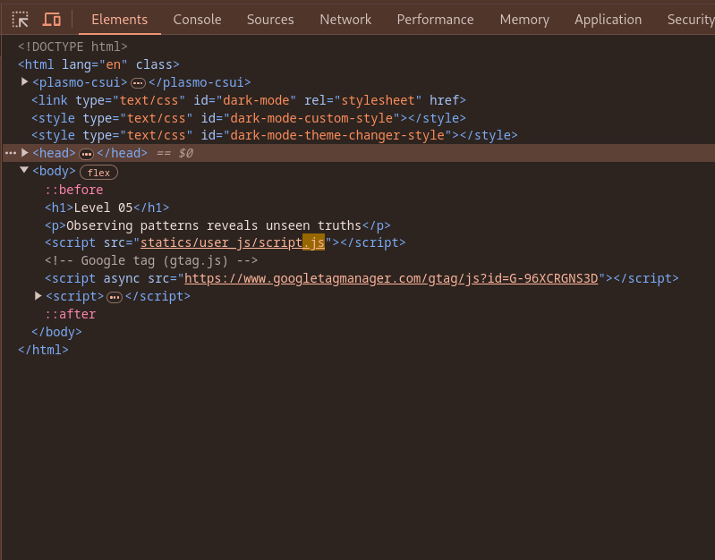
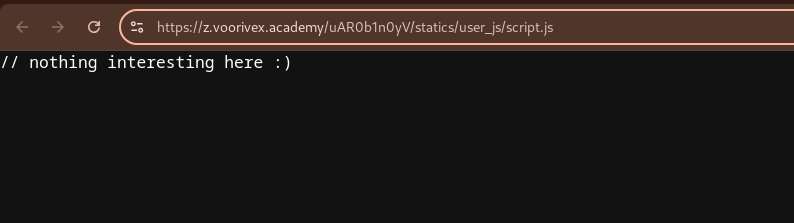
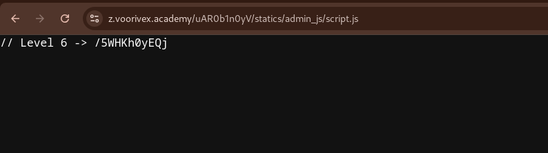

url:‌ https://z.voorivex.academy/uAR0b1n0yV
hint: Observing patterns reveals unseen truths

next level url :‌ https://z.voorivex.academy/5WHKh0yEQj

> how can find this ?

1- As in the previous step, we first inspect the first page:
 

2- find js file located at `statics/user_js/script.js`, so trying to read that from url "https://z.voorivex.academy/uAR0b1n0yV/statics/user_js/script.js" OPPPPPSSSS :)) :
 

3- We tried to open the `statics/user_js/script.js` file and we didn't find anything, how can we test the `statics/admin_js/script.js` file as well?:

