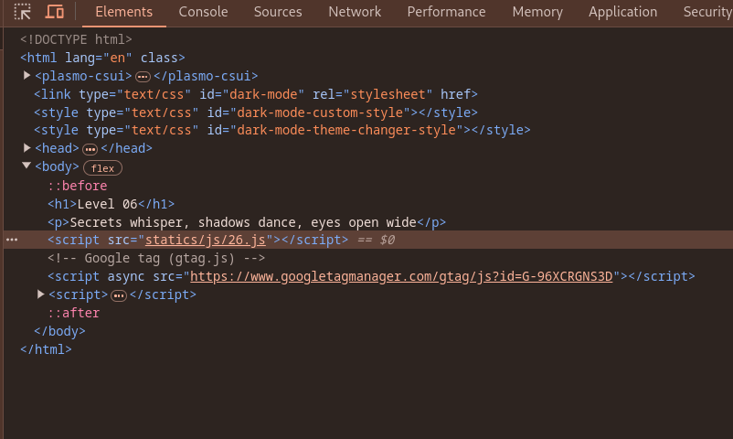
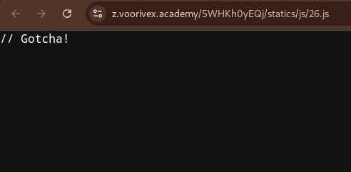
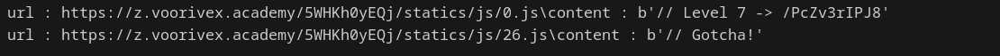

url:‌ https://z.voorivex.academy/5WHKh0yEQj
hint: Secrets whisper, shadows dance, eyes open wide

next level url :‌ https://z.voorivex.academy/PcZv3rIPJ8

> how can find this ?

1- As in the previous step, we first inspect the first page:
<br>


2- find js file located at `statics/js/26.js`, so trying to read that from url "https://z.voorivex.academy/5WHKh0yEQj/statics/js/26.js" OPPPPPSSSS :)) :
<br>


3- We think Out Of Box, so we open the `statics/js/[0-26].js` files.(I use python for checking 0.js, 1.js, 2.js, ..., 25.js)

```python
import requests

for i in range(27):
    url = f"https://z.voorivex.academy/5WHKh0yEQj/statics/js/{i}.js"
    res = requests.get(url)
    if res.status_code==200:
        print(f"url : {url}\content : {res.content}")
```

