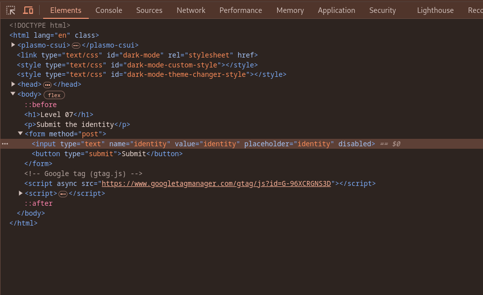
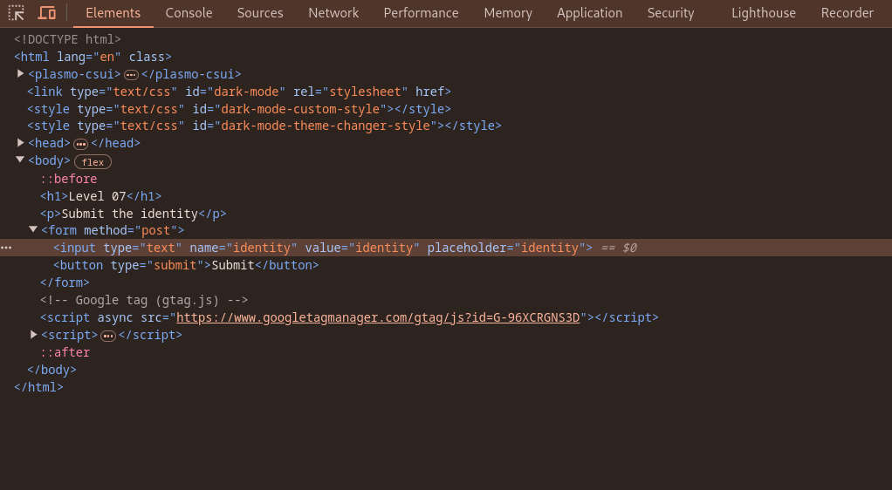
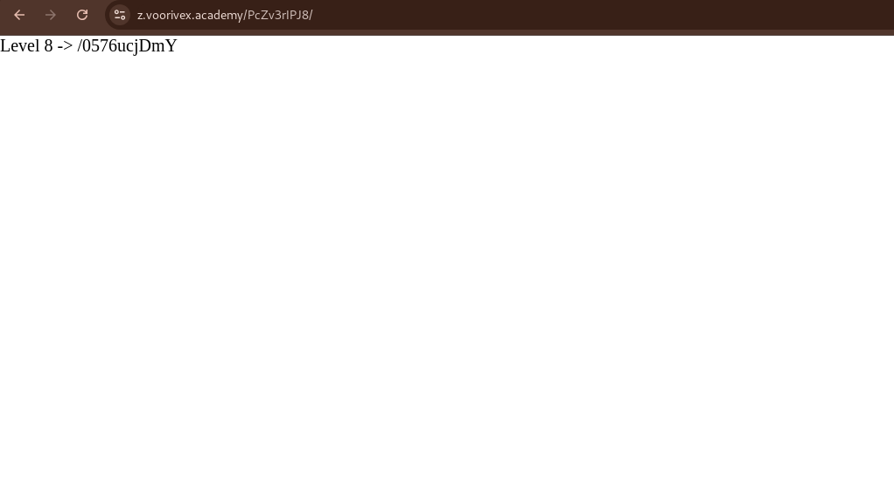

url:‌ https://z.voorivex.academy/PcZv3rIPJ8
hint: Submit the identity

next level url :‌ https://z.voorivex.academy/0576ucjDmY

> how can find this ?

1- As in the previous step, we first inspect the first page:
 

2- The `identity` input box is `disabled` so trying to `enable` it, so change the input html tag to next code :
 

3- In next step trying to submit form :
 

