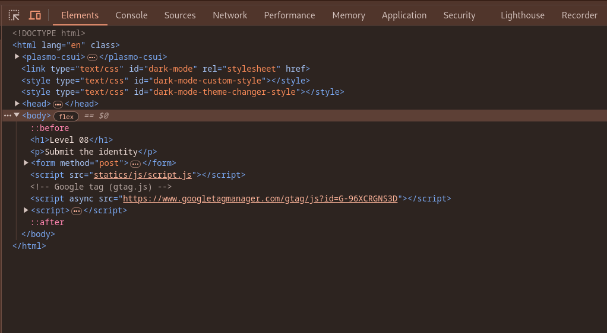
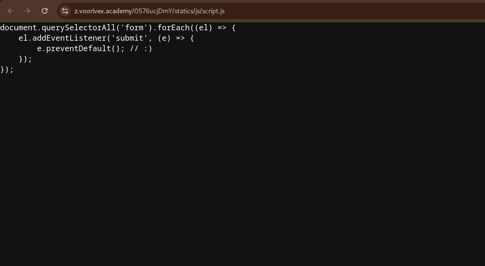
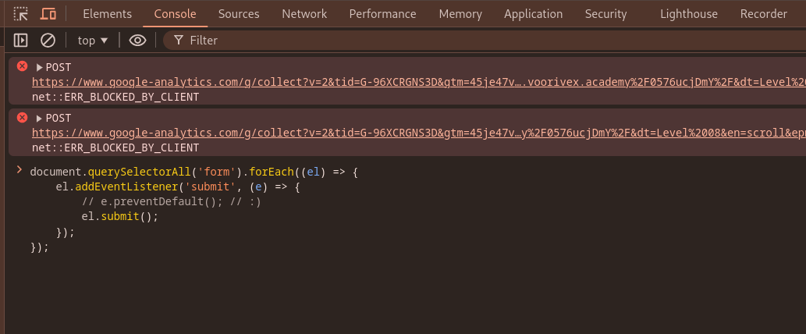
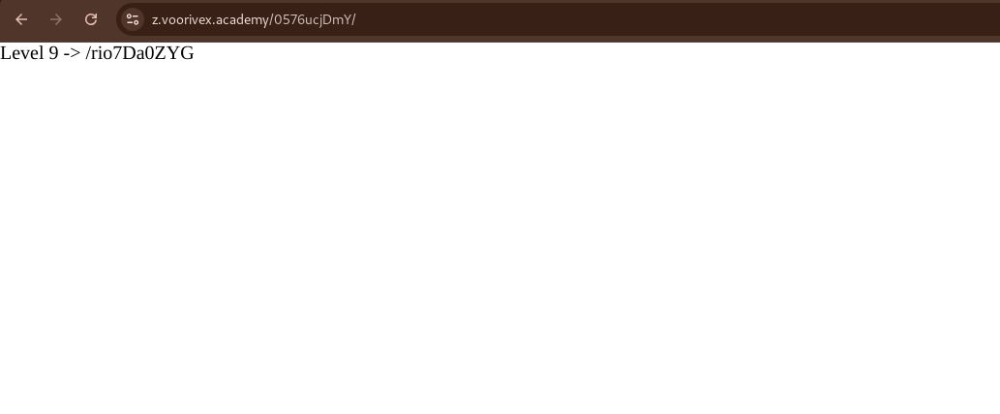

url:‌ https://z.voorivex.academy/0576ucjDmY
hint: Submit the identity

next level url :‌ https://z.voorivex.academy/rio7Da0ZYG

> how can find this ?

1- As in the previous step, we first inspect the first page:
 

2- Nothing was found on the first page, so we refer to file `statics/js/script.js` and check it :
 

3- Overwiting js code in debugger console:
 

4- tying to submit input form:

