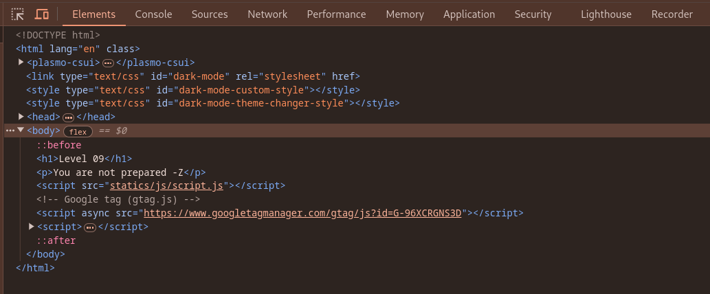
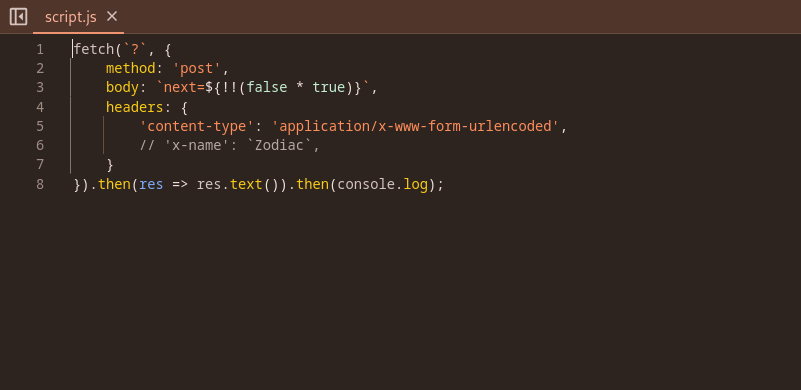
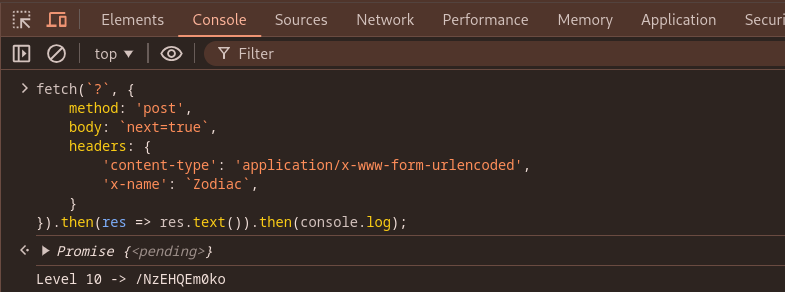

url:‌ https://z.voorivex.academy/rio7Da0ZYG
hint: You are not prepared -Z

next level url :‌ https://z.voorivex.academy/NzEHQEm0ko

> how can find this ?

1- As in the previous step, we first inspect the first page:
 

2- Nothing was found on the first page, so we refer to file `statics/js/script.js` and check it :
 

3- Change the js script and send `next=true` in body section, and add `'x-name': 'Zodiac',` on headers, and run it on console section or other tools to send request :

