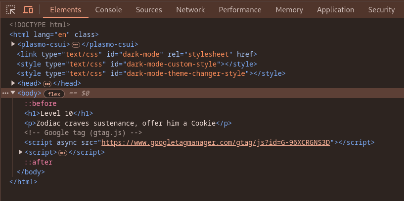
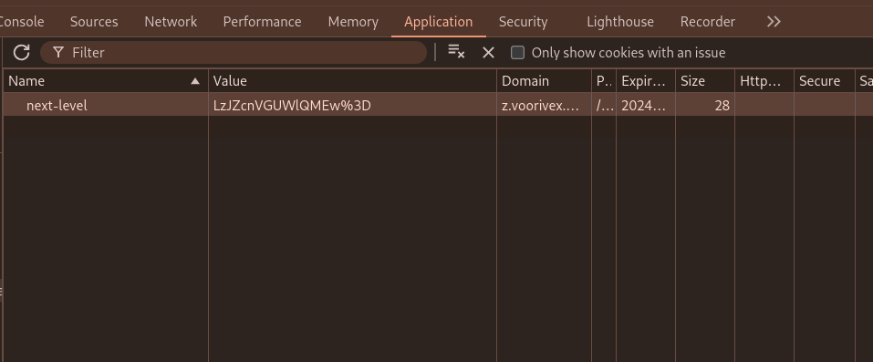
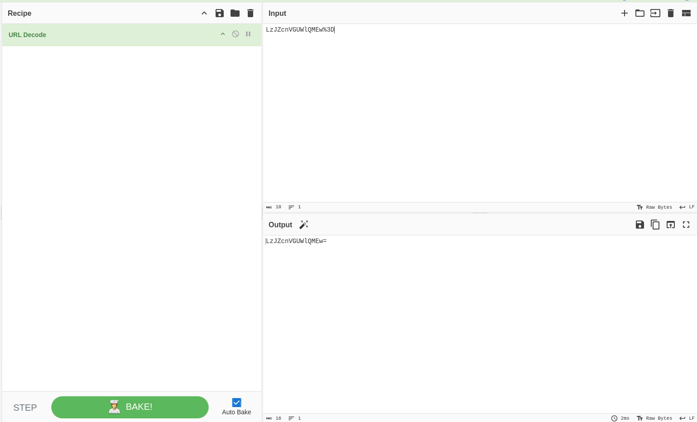

url:‌ https://z.voorivex.academy/NzEHQEm0ko
hint: Zodiac craves sustenance, offer him a Cookie

next level url :‌ https://z.voorivex.academy/2YruFQiP0L

> how can find this ?

1- As in the previous step, we first inspect the first page:
 

2- Emmm!, No js file was found, but in the hint it is said to suggest a cookie, so we will check the site's cookies.
 

3- We find a cookie with name `next-level` and value `LzJZcnVGUWlQMEw%3D`,but this cookie is like a url-encoded string, so we try to decode it using [CyberChef](https://gchq.github.io/CyberChef/).
 

4- And the output of the CyberChef like Base64 encoded string, so we try to decode it with using [CyberChef](https://gchq.github.io/CyberChef/).
