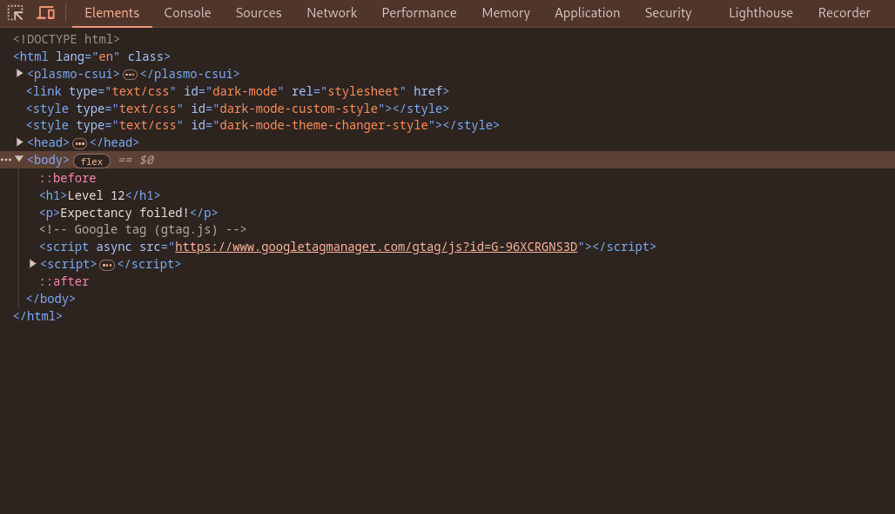
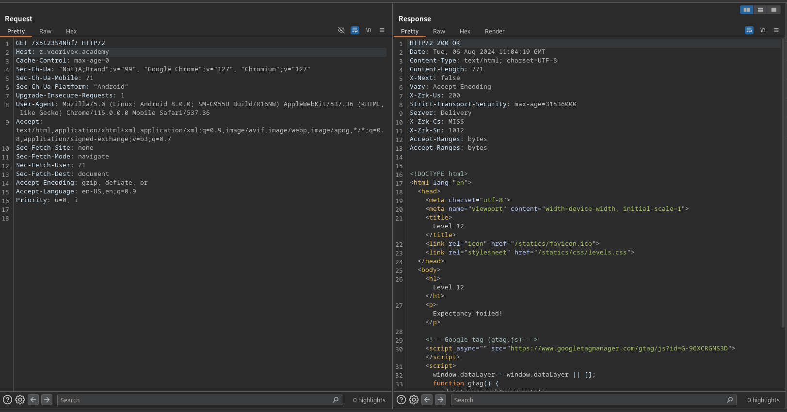
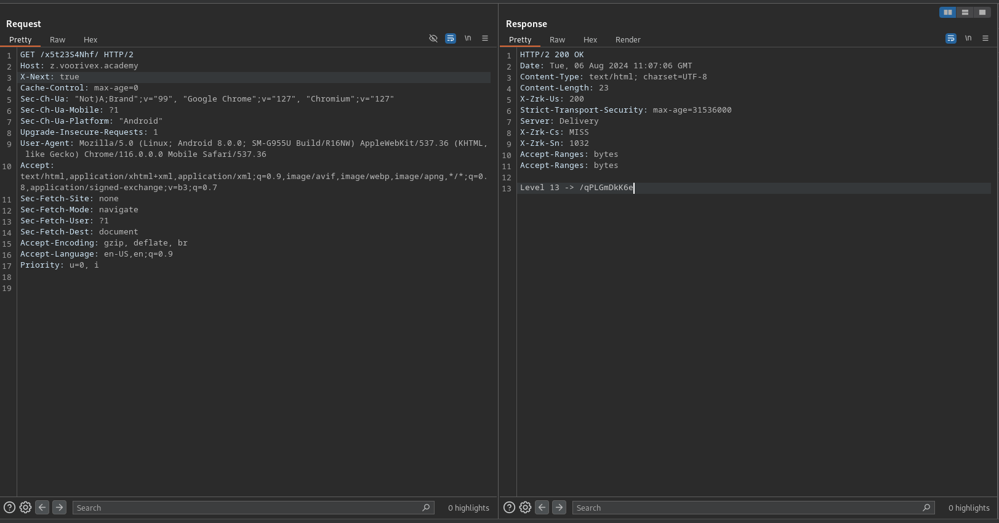

url:‌ https://z.voorivex.academy/x5t23S4Nhf
hint: Expectancy foiled!

next level url :‌ https://z.voorivex.academy/qPLGmDkK6e

> how can find this ?

1- As in the previous step, we first inspect the first page:
 

2- Intercept request with (Burp Suite)[https://portswigger.net/burp/communitydownload]:
 

3- Oooo, We find a new headers with name `X-Next` and value `false`, so set it with `true` value, and send request:
 

