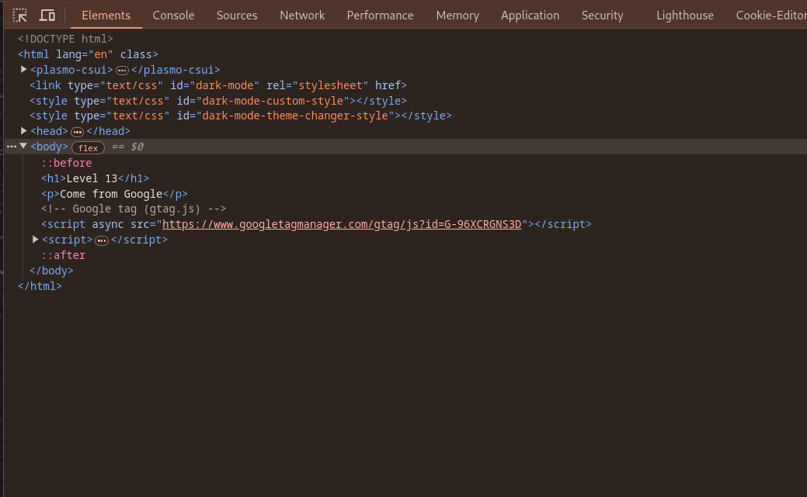
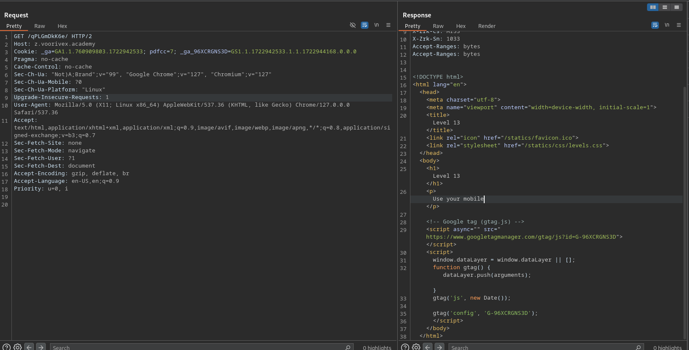
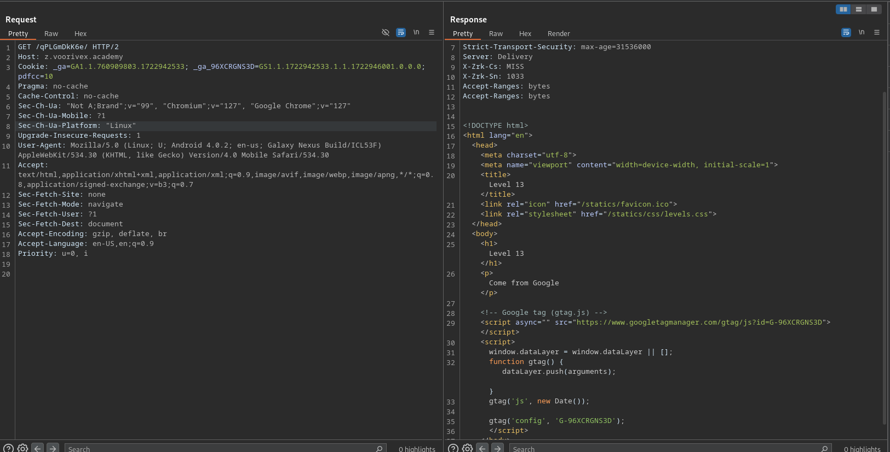
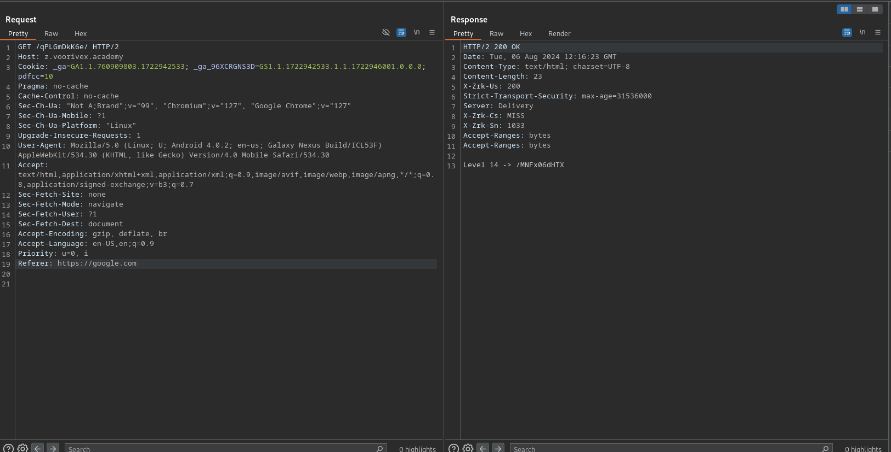

url:‌ https://z.voorivex.academy/qPLGmDkK6e
hint: Use your mobile

next level url :‌ https://z.voorivex.academy/MNFx06dHTX

> how can find this ?

1- As in the previous step, we first inspect the first page:
 

2- Intercept request with (Burp Suite)[https://portswigger.net/burp/communitydownload]:
 

3- Change `User-Agent` to `Mozilla/5.0 (Linux; U; Android 4.0.2; en-us; Galaxy Nexus Build/ICL53F) AppleWebKit/534.30 (KHTML, like Gecko) Version/4.0 Mobile Safari/534.30`:
 

3- Add `Referer` in request headers and set value `https://google.com/`:
 

