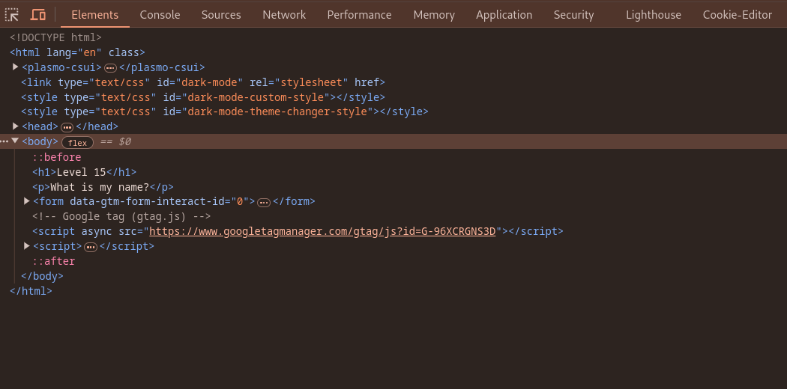
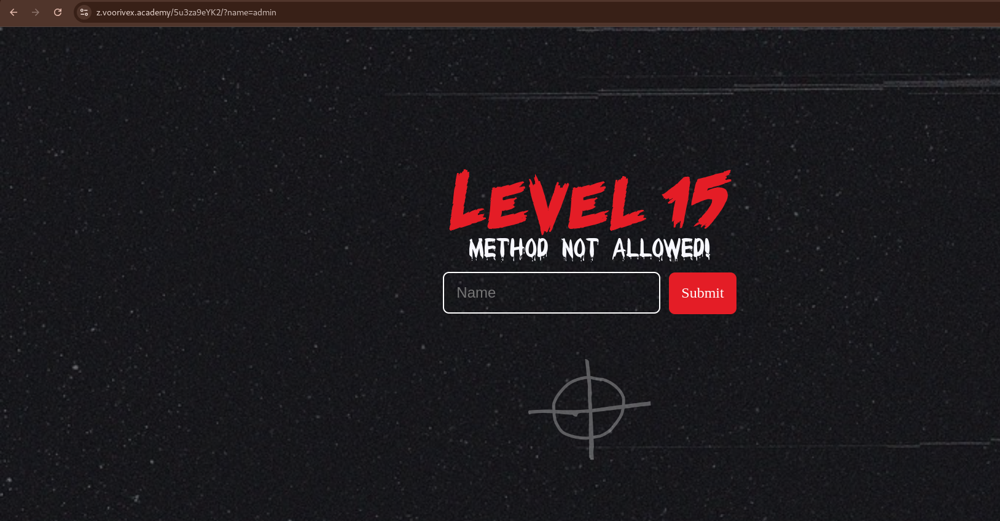
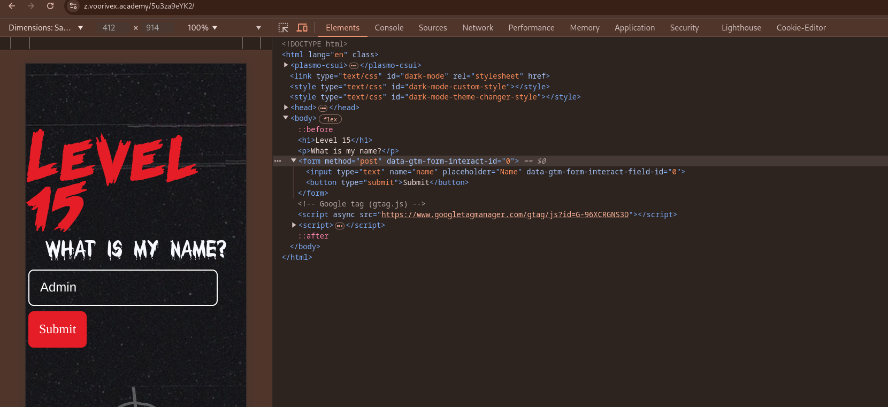
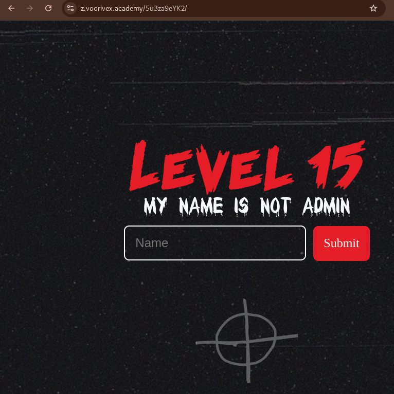

url:‌ https://z.voorivex.academy/5u3za9eYK2
hint: What is my name?

next level url :‌ https://z.voorivex.academy/wO4Cw99TrO

> how can find this ?

1- As in the previous step, we first inspect the first page:
 

2- trying to submit `admin` on input form and get `Method not allowed!`:
 

3- Change the request method to "POST":
 

 

4- We try the name is `zodic`:
 

 

5- Change the encoding type to `multipart/form-data`:
 

 

